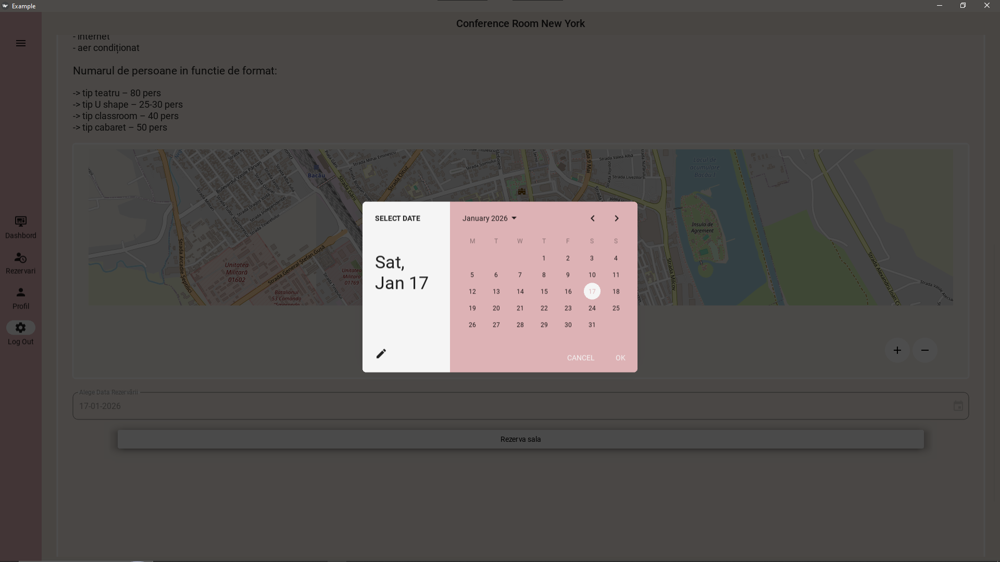
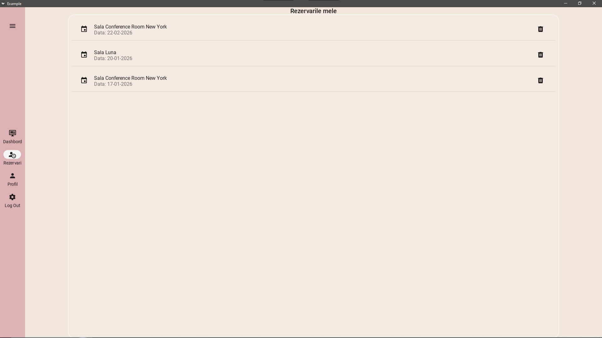
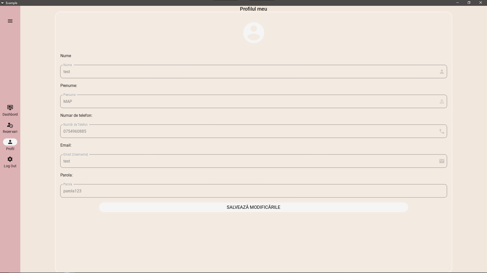

# Conference Room Booking System - Bacău

## 📌 Overview
This is a robust desktop application built with **Python** and **KivyMD**, designed specifically for managing conference room reservations in **Bacău**.

The system goes beyond simple booking; it features a **real-time, user-centric dashboard** that dynamically updates based on the logged-in user's actions. It integrates geolocation services to pinpoint venue addresses on an interactive map and provides detailed analytics about room availability.

## 🚀 Key Features

### 1. 🔄 Real-Time Dynamic Dashboard
* **Live Status Updates:** The dashboard automatically calculates and displays the number of **Free Halls** and **Occupied Halls** based on current reservations.
* **User-Specific Data:** The "My Reservations" counter and view are personalized. Each user sees only their own booking history, while the room availability is global and synchronized for everyone.
* **Interactive Feedback (MDSnackbar):** The app communicates every state change clearly. Whether it's a **success message** after booking, a **validation error**, or a general notification, users receive instant, non-intrusive feedback via custom Snackbars.

### 2. 📍 Smart Location & Mapping
* **Integrated Maps:** Uses `kivy_garden.mapview` and `geopy` to render interactive maps inside the application.
* **Asynchronous Geocoding:** Addresses (e.g., "Strada Dumbrava Roșie, Bacău") are converted to coordinates in the background (using Threading) to prevent UI freezing while loading the map.
* **Pinpoint Accuracy:** Markers are dynamically placed on the exact location of the conference hall.

### 3. 🏢 Comprehensive Venue Management
* **Detailed Room Profiles:** Users can view extensive details for each hall, including:
    * **Amenities:** Projectors, Flip-charts, Wi-Fi, Sound systems.
    * **Capacity:** Dynamic capacity listing based on layout (Theater, U-Shape, Classroom, Cabaret).
    * **Surface Area:** Square footage details.
* **Visual Gallery:** Each room features a representative image to help users decide.

### 4. 📅 Seamless Reservation System
* **Conflict Detection:** The system prevents double-booking by checking date availability in real-time.
* **Intuitive Date Picker:** Modern Material Design date selection tool.
* **Management:** Users can view their active reservations in a dedicated list and cancel them if necessary (Trash icon).

### 5. 👤 Profile, Security & Error Handling
* **Secure Authentication:** Robust Login and Sign-up system with strict input validation.
* **Smart Error Notifications:** If a user enters a wrong password, misses a required field, or uses an invalid email format, the system instantly triggers an **MDSnackbar** alert to guide them.
* **Profile Customization:** Users can update their contact details (Phone, Email, Name) and Password directly from the app.

## 📷 Screenshots

| **Dashboard & Real-Time Stats** | **Room Details & Map** |
|:---:|:---:|
|  |  |
| *Overview of available rooms and daily stats* | *Specific amenities and location on map* |

| **Reservation Process** | **My Reservations (User Specific)** |
|:---:|:---:|
|  |  |
| *Selecting a date for the event* | *Personalized list of booked slots* |

| **User Profile** |
|:---:|
|  |
| *Editable user information* |

## 🛠️ Tech Stack
* **Language:** Python 3.13
* **UI Framework:** Kivy & KivyMD (Material Design)
* **Geolocation:** `geopy` (Nominatim API) & `kivy_garden.mapview`.
* **Concurrency:** Python `threading` module for background tasks.
* **Database:** Oracle Database (Managed via SQL Developer) - Uses PL/SQL for robust data handling.
* **Driver:**  `oracledb`.

## 📦 How to Run

1.  **Clone the repository:**
    ```bash
    git clone [https://github.com/ecatauta2/Conference-Room-Booking-System](https://github.com/ecatauta2/Conference-Room-Booking-System)
    ```
2.  **Navigate to the folder:**
    ```bash
    cd YOUR_PROJECT_NAME
    ```
3.  **Install dependencies (Crucial Step):**
    To ensure the application runs exactly as intended, you must install the specific library versions listed in `requirements.txt`.
    ```bash
    pip install -r requirements.txt
    ```
4.  **Database Configuration:**
    * **Import Schema:** Run the `database_setup.sql` script in Oracle SQL Developer to create the necessary tables and objects.
    * **Connection:** Update the connection string in the code with your own Oracle credentials (Host, Port, Service Name).

5.  **Run the application:**
    The application will initialize the local database automatically upon the first run.
    ```bash
    python main.py
    ```

---
Developed by **Elena Cătăuță**